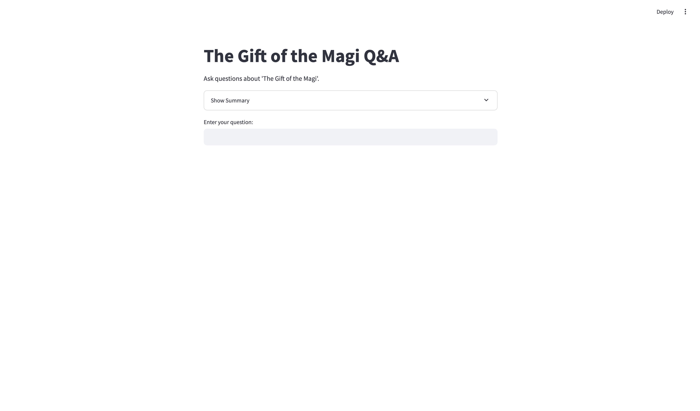
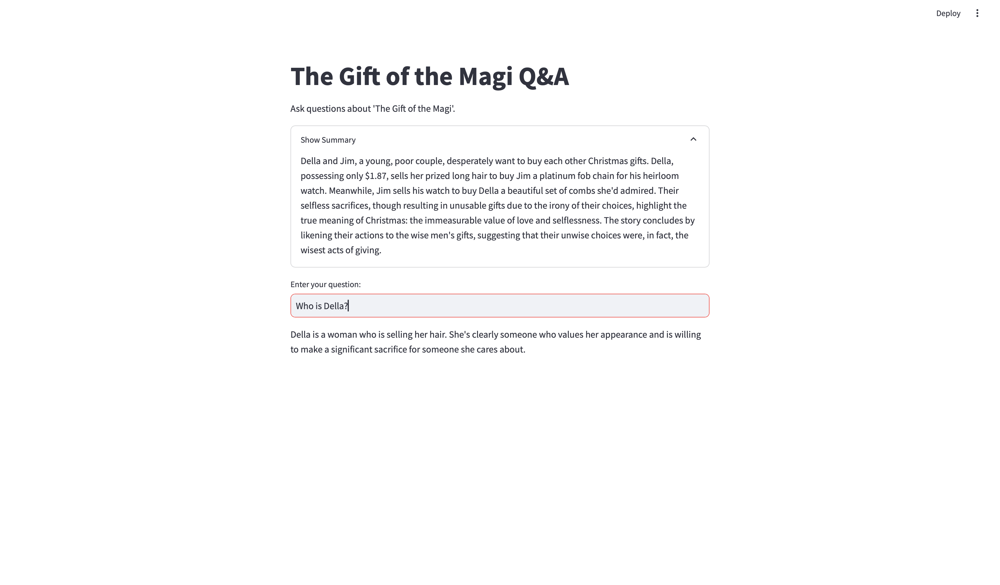
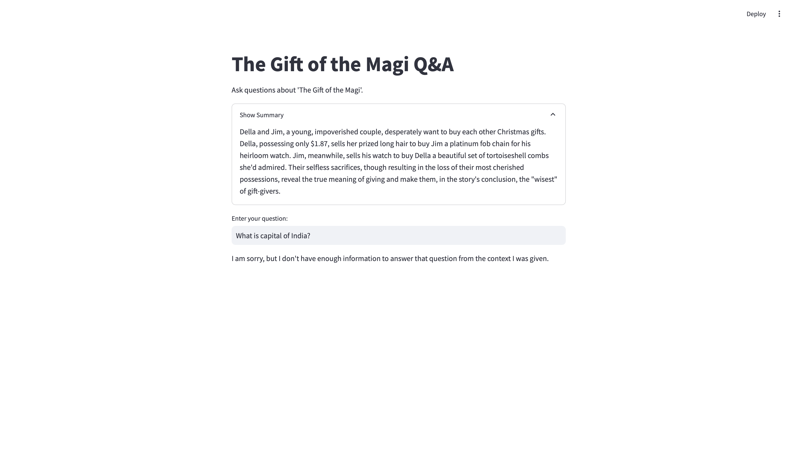

# PDF Question Answering with RAG (Retrieval-Augmented Generation)

This project implements a Retrieval-Augmented Generation (RAG) system that allows users to ask questions about the content of a provided PDF document ("The Gift of the Magi.pdf").  It uses Streamlit for the web interface, Google Gemini 1.5 Flash for OCR and text generation, and ChromaDB for vector storage.  The system is specifically designed to work with the included `The_Gift_of_the_Magi.pdf` file, but the structure is in place to be adaptable.

## Features

*   **Pre-loaded PDF:** The application is pre-configured to process "The Gift of the Magi.pdf".
*   **OCR:** Extracts text from the PDF using Google Gemini's vision capabilities (handles scanned documents).  The included PDF is already supported.
*   **Summarization:** Generates a concise summary of the document.
*   **Question Answering:** Answers questions based on the PDF content using a RAG approach.
*   **Vector Database:** Uses ChromaDB for efficient similarity search and retrieval of relevant text chunks.
*   **Web Interface:** Provides a simple, interactive web interface with Streamlit.

## Dependencies

*   PyMuPDF (fitz)
*   google-generativeai
*   sentence-transformers
*   chromadb
*   streamlit
*   python-dotenv
*   Pillow (PIL)
*   numpy

These can be installed using: `pip install -r requirements.txt`  (You'll need to create a `requirements.txt` file).

## Setup

1.  **Clone the repository:**

    ```bash
    git clone https://github.com/vishisht245/magi-qa-bot.git
    cd magi-qa-bot.git
    ```

2.  **Create a virtual environment (recommended):**

    It's highly recommended to use a virtual environment.

    *   **Using `venv` (built-in, Python 3.3+):**

        ```bash
        python3 -m venv .venv
        ```

    *   **Activating the virtual environment:**

        *   **On Linux/macOS:**
            ```bash
            source .venv/bin/activate
            ```

        *   **On Windows (Command Prompt):**
            ```bash
            .venv\Scripts\activate
            ```

        *   **On Windows (PowerShell):**
            ```bash
            .venv\Scripts\Activate.ps1
            ```

3.  **Install Dependencies:**

    Create a `requirements.txt` file with the following content:

    ```
    PyMuPDF
    google-generativeai
    sentence-transformers
    chromadb
    streamlit
    python-dotenv
    Pillow
    numpy
    ```
    Then, run:

    ```bash
    pip install -r requirements.txt
    ```

4.  **Obtain a Google Gemini API Key:**

    *   Go to [Google AI Studio](https://ai.google.dev/).
    *   Create a new project (or use an existing one).
    *   Create an API Key.

5.  **Set the API Key:**

    *   Create a `.env` file in the project's root directory:
        ```
        GOOGLE_API_KEY="your-api-key-here"
        ```
        Replace `"your-api-key-here"` with your actual API key.

6.  **Ensure "The_Gift_of_the_Magi.pdf" is present:** The file `The_Gift_of_the_Magi.pdf` must be in the same directory as `app.py` for the application to work correctly.

## Running the Application

1.  Make sure you are in your virtual environment (activate it if necessary).
2.  Run the Streamlit app:

    ```bash
    streamlit run app.py
    ```

3.  A new tab will open in your web browser with the application. You can now ask questions about "The Gift of the Magi".

## Design Choices

*   **OCR:** Gemini's `gemini-1.5-flash` model is used with image input (via PIL) for accurate text extraction, even from scanned PDFs. The OCR process extracts text page by page.
*   **Chunking:** A sliding window approach is used, with a `chunk_size` of 500 characters and an `overlap` of 50 characters. This helps maintain context between chunks.
*   **Vector Database:** ChromaDB is used in-memory for storing and retrieving text chunks.  This provides fast similarity search.
*   **LLM:**  Gemini (`gemini-1.5-flash`) is used consistently for OCR, summarization, and answer generation.
*   **Caching:** Streamlit's `@st.cache_resource` is used to cache the `RAGService`. This prevents unnecessary re-initialization of the service (including re-extracting text and re-creating the ChromaDB collection) on every interaction.  This significantly improves performance.

*   **Prompt Engineering:**

    *   **OCR Prompt:** `"Extract all the text from this image:"` (Used within the `preprocessing.py` module).
    *   **Summarization Prompt:**
        ```
        Summarize the following text in a concise and informative way,
        capturing all the main points making message of text understandable:

        {text}
        ```
    *   **RAG Prompt:**
        ```
        Answer the following question based on the context provided but don't mention it, keep the tone friendly and warm and answer with confidence:
        Question: {query}
        Context:
        {context}

        If the answer cannot be found in the context, respond with 'I am sorry, but I don't have enough information to answer that question from the context I was given.'
        ```

## Usage


The application is pre-loaded with "The Gift of the Magi.pdf". You can interact with it as follows:

1.  **Ask Questions:** Type your question about "The Gift of the Magi" into the text input box and press Enter (or click any submit button if present).

2.  **View the Summary:**  To see a concise summary of the story, click the "Show Summary" expander. This will reveal the generated summary.

**Examples:**

Below are examples demonstrating how to use the application.  The screenshots illustrate the expected behavior.

**(Initial View - Ready to Ask a Question)**


*   The application starts with the question input box ready.

**(Example 1: Question Within the Story's Context)**

*   **Question:** Who is Della?
*   _Expected Result:_ The application will provide an answer based on the content of "The Gift of the Magi".


*   _Screenshot showing the question and the correct answer._

**(Example 2: Question Outside the Story's Context)**

*   **Question:** What is the capital of India?
*   _Expected Result:_ The application will respond with a message indicating it doesn't have enough information, as the answer is not found in the story.


*  _Screenshot showing the question and the "I am sorry..." response._


## RAG Implementation

1.  **PDF Loading and OCR:**  The `preprocessing.py` module uses `fitz` (PyMuPDF) and Gemini to extract the text from "The_Gift_of_the_Magi.pdf", page by page.
2.  **Text Chunking:** The extracted text is split into smaller, overlapping chunks.
3.  **Embedding Generation:**  The `sentence-transformers` library (`all-MiniLM-L6-v2` model) creates embeddings for each text chunk.
4.  **Vector Storage:** The chunks and their embeddings are stored in a ChromaDB collection.
5.  **Question Processing:** When the user asks a question:
    *   The question is converted into an embedding.
    *   ChromaDB is queried to find the most relevant chunks (based on embedding similarity).
    *   The relevant chunks are combined to form a context.
    *   The question and context are sent to Gemini, which generates the answer.

## Extending to Other PDFs (Advanced)

To use this application with a different PDF:

1.  **Replace `The_Gift_of_the_Magi.pdf`:** Place your new PDF file in the same directory as `app.py` and *rename it* to `The_Gift_of_the_Magi.pdf`.  This is the simplest approach, as the code is currently hardcoded to use this filename.
2.  **(Better) Modify `app.py`:**  For a more robust solution, change the line `pdf_file = "The_Gift_of_the_Magi.pdf"` in `app.py` to accept user input for the PDF file.  You could use `st.file_uploader` to allow users to upload files directly.  This would require further modifications to handle the uploaded file correctly (e.g., saving it temporarily, passing its path to the `RAGService`, and potentially deleting it after processing).

## Troubleshooting

*   **`KeyError: 'GOOGLE_API_KEY'`:** Make sure you have created a `.env` file and set your Google Gemini API key correctly.
*   **Missing Dependencies:** Ensure all required packages are installed using `pip install -r requirements.txt`.
* **ChromaDB errors**: Make sure that you are using python 3.9 or above.
* **Other Errors**: Examine the error messages in your terminal for clues.  The code includes some basic error handling, but more complex issues might require debugging.

## Contributing

Contributions are welcome! If you'd like to contribute:

1.  Fork the repository.
2.  Create a new branch for your feature/bugfix.
3.  Make your changes.
4.  Submit a pull request.

## License
Add a license here.